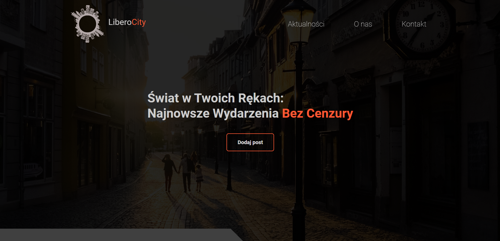
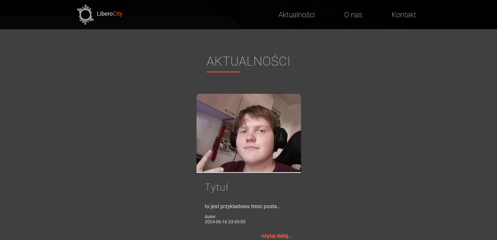
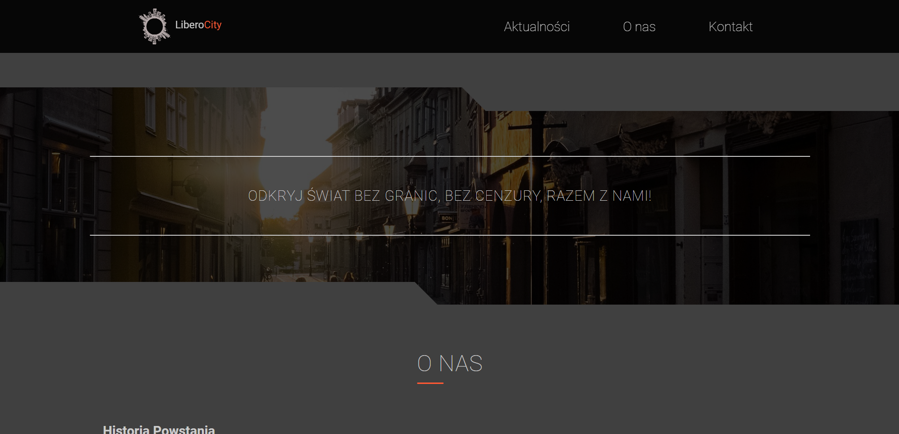
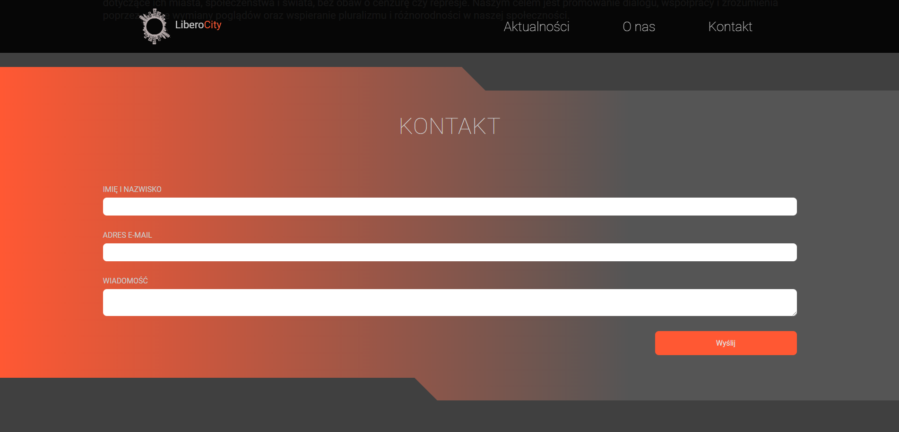
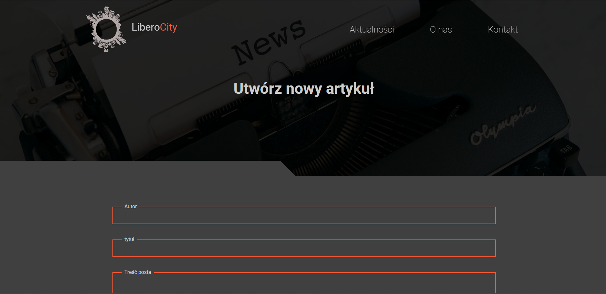
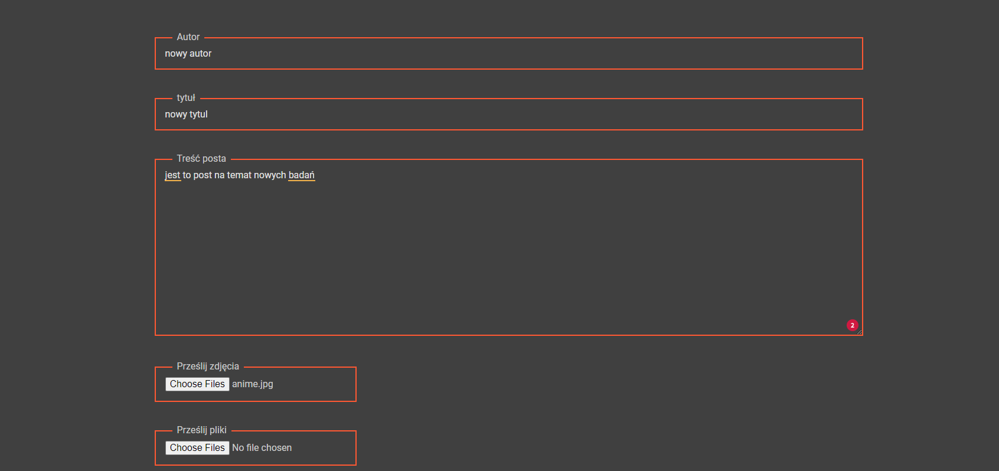
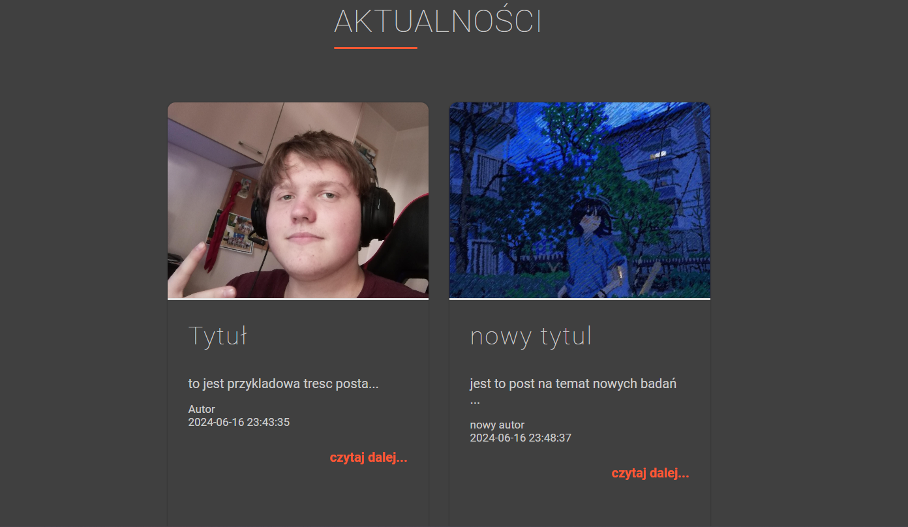
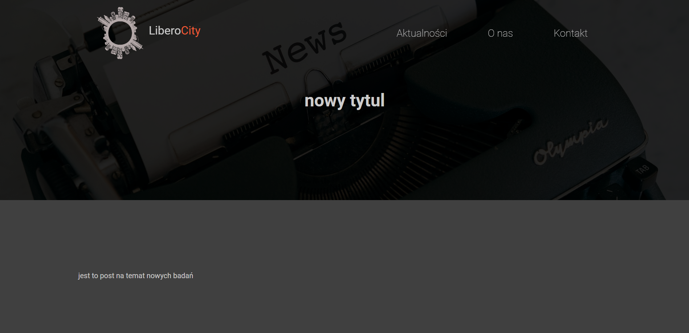

<h1 align="center">IT FOR GREEN FUTURE</h1>

  

  This is a project made as part of the school's IT FOR GREEN FUTURE competition  

  

## About The Project

The site was made as part of a training project. I worked on the site with my teammate. The project presents a blog page on which each user can upload posts can give a title to the post give their name or nickname add content and add a picture of the post.
Below are pictures of the project 

### Built With

HTML
 
SCSS
 
JavaScript
 
SQL
 
PHP

## Contact

Jakub Pachut - jakubpachut@gmail.com

Project Link: https://github.com/Szafter12/IT_FOR_GREEN/tree/master
